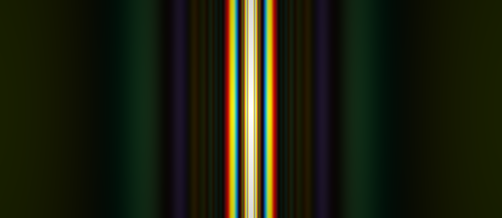

# 👋 About Me

Hi! I’m **Sofiane Beloucif**, a French **Computer Science Engineer** specialized in **Artificial Intelligence**.  
I have professional experience applying AI in the **medical field** and in **industrial applications**.  

More about me on my website: **[sofianebeloucif.com](https://www.sofianebeloucif.com/portfolio/)**

 

# 📭 Contact

	
	&nbsp;
	
	&nbsp;
	

 

# 📂 Projects

## [🌀 Quantum Diffraction Simulator](https://github.com/sofianebeloucif/Quantum-Diffraction-Simulator)

A simulation program that models **quantum diffraction phenomena**.  
It allows visualization of interference patterns and exploration of quantum physics principles.

	

 

# 🛠 Skills

	
	
	
	
	
	
	
	
	
	

 

# ⭐ Thank you for visiting!

Check out my **[GitHub](https://github.com/sofianebeloucif)** for all projects and experiments.
